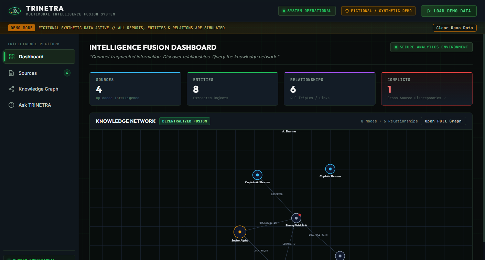
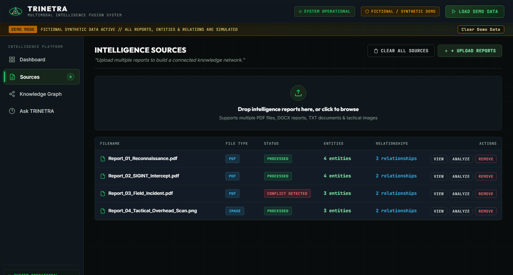
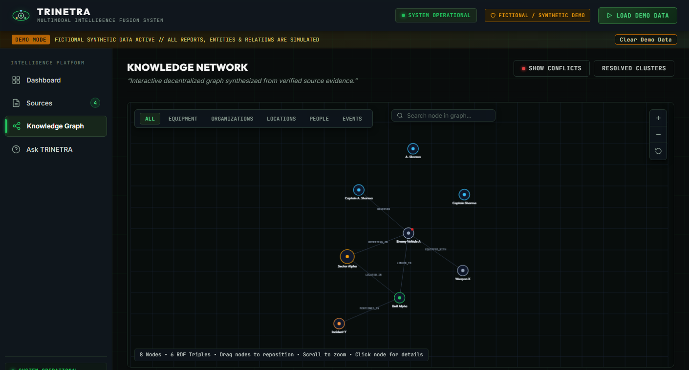
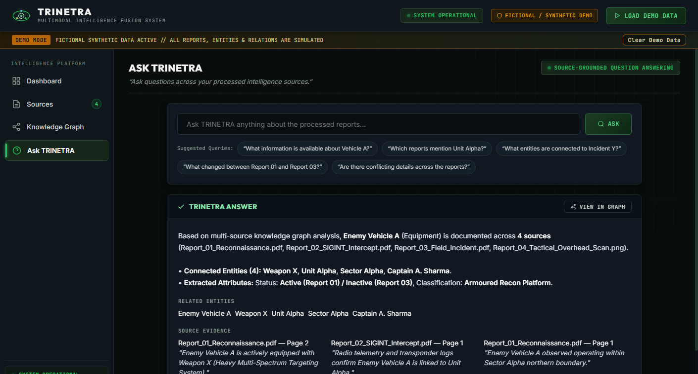

# TRINETRA — Multimodal Intelligence Fusion System

> **Tagline:** “From Fragmented Intelligence to Strategic Insight.”  
> **Problem Statement Alignment:** **PS-05 — Decentralized Knowledge Graph Builder Agent**  
> **Presentation Notice:** *Demonstration Prototype // Official Defence Intelligence Information Platform // Fictional Synthetic Scenario*

---

## 🏛️ Executive Summary & Value Proposition

In defense, emergency response, and strategic intelligence, **critical information is fragmented across disparate documents, memos, transcripts, and maps**. 

Traditional tools merely summarize individual files. **TRINETRA connects fragmented information instead of simply summarizing documents**:
1. Ingests heterogeneous formats (`PDF`, `DOCX`, `TXT`, and `Tactical Imagery`).
2. Performs Named Entity Recognition (People, Organizations, Locations, Events, Equipment).
3. Extracts formal semantic relationships into **RDF-style Triples** (`Subject - Predicate - Object`).
4. Executes **Decentralized Entity Resolution** to harmonize aliases across sources without losing provenance.
5. Fuses textual narrative with visual map coordinates and distances.
6. Flags **Information Conflicts** (e.g., conflicting coordinates or zones) for human review rather than silently picking one.
7. Powers **Natural-Language GraphRAG Querying** returning structured analysis, supporting entities, and source citations.
8. Exports knowledge networks to open W3C semantic web standards (`JSON-LD` and `Turtle .ttl`).

---

## 🎯 30-Second Hackathon Elevator Pitch

- **The Problem:** Intelligence and operations teams receive fragmented reports where key facts, entity aliases, and geographic coordinates are scattered across different formats and sources.
- **The Solution:** TRINETRA autonomously reads multi-source inputs, resolves duplicate entity variations, detects conflicting claims, constructs a unified knowledge graph, and provides verifiable natural-language GraphRAG answers.
- **The Technology:** Autonomous Agent Pipeline + Semantic RDF Triples + Entity Resolution Clustering + GraphRAG + W3C Semantic Exports.
- **Horizontal Applicability:** While demonstrated with a synthetic defense scenario, TRINETRA directly applies to **Disaster Response**, **Biomedical Research**, **Enterprise Audits**, **Government Memos**, and **Regulatory Compliance**.

---

## 📸 Interface Screenshots

### 1. Intelligence Fusion Dashboard
The unified operational dashboard with dynamic statistics (`SOURCES`, `ENTITIES`, `RELATIONSHIPS`, `CONFLICTS`) and full-width interactive knowledge network.


### 2. Sources Management & Multi-PDF Ingestion
Multi-format ingestion pipeline showing real-time processing status, entity & relationship counts, and action inspectors.


### 3. Two-Column PDF & Extraction Inspector
Direct grounding modal comparing raw document preview against extracted entities, RDF triples, and citation snippets.


### 4. Interactive Decentralized Knowledge Graph
Category-filtered force-directed knowledge graph with node search, zoom controls, and entity detail drawer.


### 5. Ask TRINETRA — Source-Grounded GraphRAG
Natural-language intelligence querying with grounded narrative answers, related entities, source citations, and graph highlighting.


---

## 🎨 Official Visual Design (Sections 3, 4, 5, 24)

- **Legitimate Official Platform:** Designed as a real-world institutional platform used by defense analysts, research organizations, and government departments. **No gaming UI, war simulators, hacker terminals, or sci-fi red alert screens.**
- **Color Palette:**
  - **Deep Midnight Navy (`#0f172a`, `#1e293b`):** Header and navigation.
  - **Clean Institutional Off-White (`#f1f5f9` / `#ffffff`):** Content cards and tables.
  - **Subtle Node Category Colors (Section 8):**
    - 🔵 **People:** Blue (`#0284c7`)
    - 🟢 **Organizations:** Green (`#15803d`)
    - 🟡 **Locations:** Gold/Brass (`#b45309`)
    - 🟠 **Events:** Orange (`#ea580c`)
    - ⚪ **Equipment:** Slate/Grey (`#475569`)
    - 🔴 **Conflicts:** Alert Red (`#dc2626`)
- **Branding:** Official emblem inspired by an eye and 3 interconnected network nodes.
- **System Labels:** `SYSTEM STATUS: OPERATIONAL` + `SECURE ANALYTICS ENVIRONMENT`.

---

## ⚙️ System Architecture & Workflow

```
                               ┌──────────────────────────────────────────────┐
                               │   Multi-Source Ingestion (PDF/DOCX/TXT/IMG)   │
                               └──────────────────────┬───────────────────────┘
                                                      │
                                                      ▼
                               ┌──────────────────────────────────────────────┐
                               │       TRINETRA 8-Stage Agent Pipeline        │
                               │  1. Ingestion  ──► 2. Understanding          │
                               │  3. Extraction ──► 4. Triples Mapping        │
                               │  5. Resolution ──► 6. Graph Construction     │
                               │  7. Conflicts  ──► 8. Source Indexing        │
                               └──────────────────────┬───────────────────────┘
                                                      │
                         ┌────────────────────────────┼────────────────────────────┐
                         ▼                            ▼                            ▼
             ┌───────────────────────┐    ┌───────────────────────┐    ┌───────────────────────┐
             │   Entity Resolution   │    │  Information Conflict │    │ GraphRAG Natural      │
             │   Alpha Sector        │    │  Factory Bravo        │    │ Language Query Engine │
             │   Sector Alpha        │    │  Zone 12 vs Zone 14   │    │ Answer + Citations    │
             │   Sector-A            │    │  (10.45 km offset)    │    │ + Subgraph Highlight  │
             │   ──► SECTOR ALPHA    │    │  ──► FLAGGED CONFLICT │    │                       │
             └───────────────────────┘    └───────────────────────┘    └───────────────────────┘
```

---

## 🚀 Step-by-Step Hackathon Live Demonstration Flow

| Step | Action | What to Explain to Judges |
|:---|:---|:---|
| **Step 1** | Open Dashboard (`http://127.0.0.1:8000`) | Show the official, clean intelligence dashboard with 6 KPI summary cards and the interactive knowledge network. |
| **Step 2** | State the Problem | *“In intelligence, information is fragmented across multiple reports. Summarization loses connections.”* |
| **Step 3** | Ingestion & Pipeline (`Sources` Tab) | Show the multi-format source table (PDF, DOCX, Imagery) and the verified 8-stage analysis pipeline. |
| **Step 4** | Entity Resolution (`Entity Resolution` Tab) | Show how lexical variations (`Alpha Sector`, `Sector-A`, `Sector Alpha`) were clustered into **`SECTOR ALPHA`** with 94% confidence and complete provenance. |
| **Step 5** | Unified Graph (`Knowledge Graph` Tab) | Show how separate reports merge into one graph. Click on **Sector Alpha** to open the side panel showing 4 source mentions, connected entities, and quotes. |
| **Step 6** | RDF Triples (`Relationships` Tab) | Show the formal **Subject — Predicate — Object** triple table with citation evidence (PS-05 requirement). |
| **Step 7** | Conflict Detection (`Conflicts` Tab) | Show how `Factory Bravo` has conflicting locations (Zone 12 in Report 02 vs Zone 14 in Report 03). Explain that TRINETRA preserves both citations for analyst review rather than hallucinating. |
| **Step 8** | GraphRAG (`Ask TRINETRA` Tab) | Ask: *“Which entities are connected to Sector Alpha?”* Show the synthesized natural-language analysis, supporting entities, and source document citations. |
| **Step 9** | Semantic Export (`Export` Tab) | Show 1-click **JSON-LD** and **RDF Turtle (.ttl)** download endpoints for interoperability. |
| **Step 10** | Civilian Applications | Highlight horizontal relevance to **Disaster Response**, **Research**, and **Enterprise Governance**. |

---

## 📡 API Reference (Section 28)

| Method | Endpoint | Description |
|:---|:---|:---|
| `GET` | `/status` | Platform status, telemetry, version, and security label |
| `GET` | `/documents` | Processed sources list with entity and relation counts |
| `POST` | `/documents/upload` | Ingests PDF, DOCX, TXT, or Image file into pipeline |
| `GET` | `/entities` | Extracted entities with categories and aliases |
| `GET` | `/entities/{id}` | Detailed entity inspector with source evidence quotes |
| `GET` | `/graph` | Unified knowledge graph (nodes, edges, conflicts, stats) |
| `GET` | `/triples` | RDF Subject-Predicate-Object statements |
| `GET` | `/resolutions` | Entity resolution clusters and confidence scores |
| `GET` | `/conflicts` | Flagged multi-source factual discrepancies |
| `POST` | `/query` | GraphRAG natural-language question answering |
| `POST` | `/demo/load` | Preloads synthetic demonstration scenario |
| `GET` | `/export/jsonld` | Exports graph as W3C standard JSON-LD |
| `GET` | `/export/turtle` | Exports graph as W3C RDF Turtle format |
| `GET` | `/pipeline/status` | Real-time status of 8-stage analysis pipeline |
| `GET` | `/agents/status` | Operational status of autonomous analysis modules |

---

## 💻 Quick Start & Running Locally

### 1. Requirements
- Python 3.10+
- Installed packages: `fastapi`, `uvicorn`, `pymupdf`, `python-docx`, `pillow`, `networkx`, `python-multipart`, `pydantic-settings`

### 2. Launch the Application
```powershell
cd d:\TRINETRA\backend
python -m uvicorn app.main:app --host 127.0.0.1 --port 8000
```

### 3. Access in Browser
Open:
```
http://127.0.0.1:8000
```
Click **"Demonstration Scenario"** in the top header to load the synthetic multi-source intelligence dataset.
